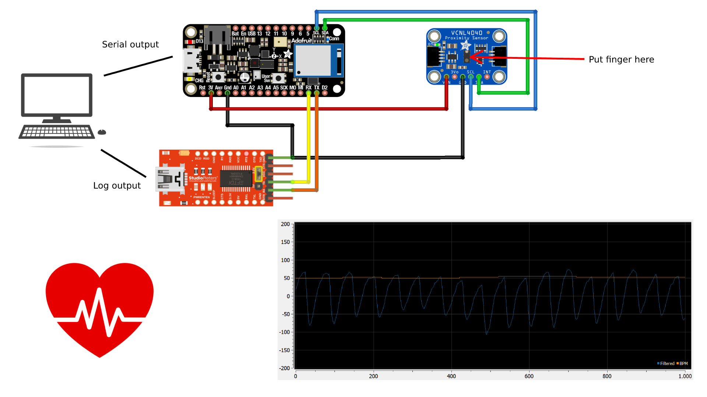

# PPG using proximity sensor


This project demonstrates the ability of a proximity sensor to function as a crude PPG sensor.
The proximity sensor used in this project is VCNL4040, connected to [Adafruit Feather nRF52840](https://learn.adafruit.com/adafruit-feather-sense) board.

This repo contains BSP for the Adafruit Feather nRF52840 board used in this project.
Just copy the `boards` folder to `<SDK_installation_dir>/zephyr` directory.

The project is developed using [nRF Connect SDK](https://www.nordicsemi.com/Products/Development-software/nrf-connect-sdk), using Zephyr RTOS.
The code is written in C++.
The DSP part uses [CMSIS-DSP](https://arm-software.github.io/CMSIS_5/DSP/html/index.html) library.


## Brief overview



The proximity sensor is sampled with a fixed sample rate of 50 Hz.
The raw proximity samples are filtered with second-order Butterworth IIR bandpass filter and are stored in a circular buffer.
When the required amount of samples is collected, we perform FFT on the samples and find the frequency bin of the maximum in the amplitude spectrum.
Then we can use this frequency to compute the heart rate in beats per minute (BPM).
The USB is configured in composite mode, providing options for DFU and USB-CDC.
USB-CDC is used to ouptut the data, in the following format:
```
timestampUs,raw,filtered,bpm
```

## Useful software

### [SerialPlot](https://hackaday.io/project/5334-serialplot-realtime-plotting-software)

Allows to easily visualize the serial output.
Settings file can be found under `docs` folder.

### Python scripts

Under `scripts` folder, there are python scripts and notebook containing code for:
- Generating array of IIR filter coefficients from filter designed in SciPy, for CMSIS-DSP,
- Plotting hexdump output, useful for plotting large arrays, for example FFT output,
- Jupyter notebook which is useful for testing/developing the heart rate detection method.